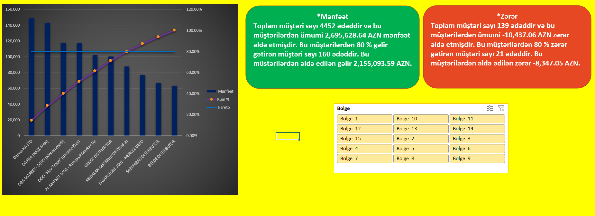

# 📊 Pareto Analysis - Excel Project

This Excel project provides a **Pareto Analysis** to evaluate the sales and loss performance of various customers, regions, and products. The analysis helps identify the key contributors to profit and loss, following the Pareto principle (80/20 rule).

---

## 📁 Project Overview

The dashboard and analysis contain the following key sections:

1. **Pareto Chart**: Displays the relationship between the total profit and loss from customers, helping to identify which customers contribute the most.
2. **Customer Sales and Loss Data**: Analyzes the total number of customers and revenue generated versus the losses incurred.
3. **Region Data**: Breakdown of regions where sales and losses are tracked.
4. **Profit and Loss Summary**: Key metrics summarizing total profits and losses, along with the Pareto breakdown.

---

## 🔑 Key Features

### 1. **Pareto Chart for Profit and Loss**
The Pareto chart shows:

- **Profit**: A visual representation of total sales and profit. The chart helps to identify the **80% of the profit** coming from **20% of the customers**.
  - Total Profit: **2,695,628.64 AZN**
  - **80% of profit** comes from **160 customers**.
  - Total Profit from these customers: **2,155,093.59 AZN**.

- **Loss**: A visual representation of losses across customers, allowing you to identify the **80% of loss** coming from **20% of the customers**.
  - Total Loss: **-10,437.06 AZN**
  - **80% of loss** comes from **21 customers**.
  - Total Loss from these customers: **-8,347.05 AZN**.

This chart uses a combination of bar and line graphs to show both the cumulative percentage of profit and the cumulative percentage of customers.

### 2. **Customer Data Breakdown**
A summary of customer data, including:
- The **total number of customers**: 4,452 customers
- Total sales and profit for each customer, showing how much each customer contributes to the total profit.

### 3. **Region Data**
The dashboard provides an analysis of sales and losses by **region**. Each region's customers and their respective sales are listed:
- Regions such as **Bolge_1**, **Bolge_2**, **Bolge_3**, and so on are displayed.
- Each region includes the sales and profit/loss details for the customers in that region.

### 4. **Profit and Loss Summary**
Key metrics for the total profit and loss across all customers and regions:
- **Total Profit**: The overall profit is displayed, helping you understand the major contributors.
- **Total Loss**: Shows the overall losses and how they relate to specific regions and customers.
  
### 5. **Interactive Filters**
- **Region Filter**: View the Pareto analysis and sales data for specific regions.
- **Customer Filter**: Narrow down the analysis by selecting a particular customer.

---

## 🧑‍💻 Technologies Used

- **Microsoft Excel** for data management and visualization.
- **Pivot Tables** to summarize and analyze the sales and profit/loss data by region and customer.
- **Charts (Pareto, Bar, Line)** to visualize the profit and loss breakdown.
- **Excel Formulas** for calculating cumulative profits, losses, and percentages.

---

## 🚀 Use Cases

- **Profit Optimization**: Identify the top customers that contribute the most to profits and focus on retaining them.
- **Loss Minimization**: Identify customers who generate losses and determine strategies for minimizing losses.
- **Sales Strategy**: Understand the most profitable regions and customers to target for future sales efforts.
- **Resource Allocation**: Allocate resources based on regions and customers with the highest profit margins.

---

## 🧠 Future Enhancements

- **Real-Time Data Integration**: Integrate with live data to constantly update the dashboard with new sales and loss information.
- **Advanced Analytics**: Introduce predictive modeling to forecast future profits and losses based on current trends.
- **Customizable Filters**: Allow dynamic filtering by other variables, such as product categories, customer segments, etc.
- **Geographical Analysis**: Incorporate geographical maps to visualize region-based sales and loss patterns.

---

## 📷 Screenshot of Pareto Chart

> *Ensure the images are correctly linked in your repo directory.*

---

## 🧑‍💼 Author

- **[Abdulsalam Alizade]**  
Sales Analyst | Excel Expert | Data Analyst

---

